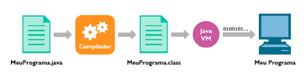

## *Oi, meu nome é Lucas*

O processo fuciona quando escrevemos um código java e então um compilador chamado javac compila esse código e o torna legível para a linguagem de máquina, assim podendo ser lida pela JVM e taduzido paa diversos tipos de sistemas, como Windows, Linux e Mac.
